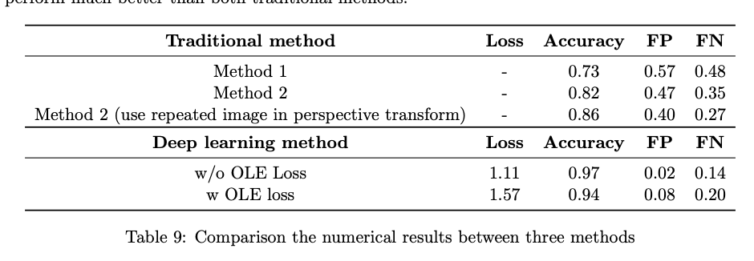

Lane Detection
==

inal project codes for Computer vision in spring semester at NYCU. This is a basic lane detection using TuSimple dataset

## 109-2 CV Final
* Zhi-Yi Chin joycenerd.cs09@nycu.edu.tw
* Shao-Yu Weng nthu106071077@gapp.nthu.edu.tw
* Bo-Yu Cheng nemo1999.eecs06@g2.nctu.edu.tw

## Technologies

### Prerequisite:

```
conda environment
1080Ti or 2080Ti GPU device
pytorch
torchvision
visdom
cudatoolkit=10.1
opencv
sklearn
ujson
matplotlib
```

### Method Description

#### Deep Learning Method

2 Hourglass Network + aggregation of SGPN loss

#### Traditional Method

* Method 1: Edge detection + Hough transform
* Method 2: Perspective transform

## Results




## License

[](https://opensource.org/licenses/MIT)
